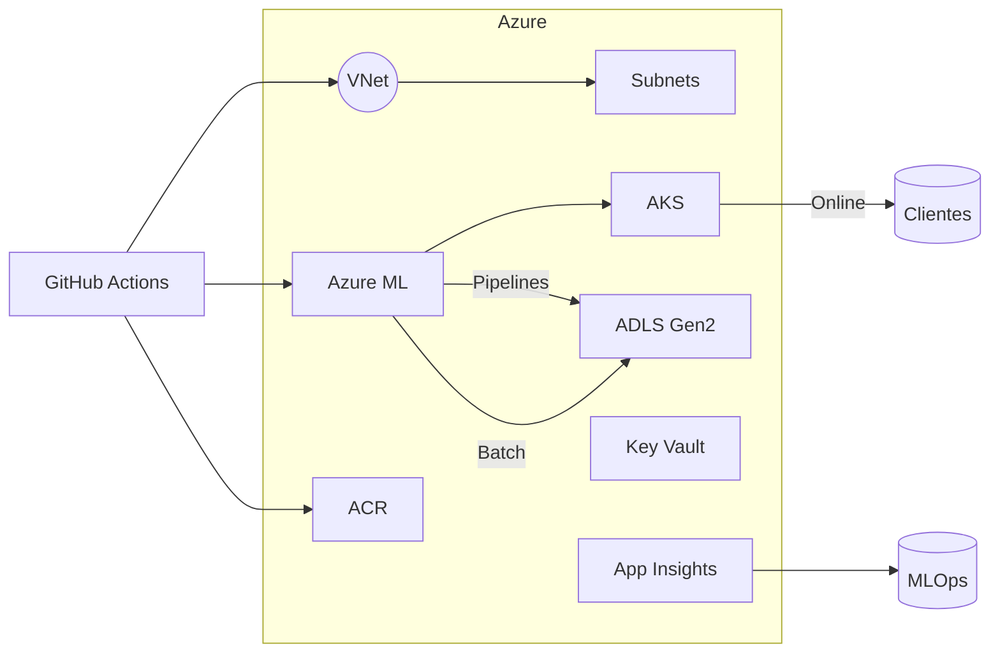

# ARCHITECTURE.md

## Resumen
IaC provisiona Azure (VNet, AML, AKS, ACR, observabilidad). AML orquesta pipelines, AKS sirve inferencia, trabajos batch usan ADLS y App Insights/Log Analytics centralizan telemetría.

## Diagrama

## Módulos
- **Infraestructura** (`infra/terraform`): módulos `network` y `aml` despliegan recursos privados.【F:infra/terraform/main.tf†L1-L39】【F:infra/terraform/modules/aml/main.tf†L1-L81】
- **Entrenamiento** (`src/training`): registra `roc_auc` y artefactos MLflow.【F:src/training/train.py†L1-L65】
- **Online** (`src/inference/online`): FastAPI + Prometheus + `X-Request-Id`.【F:src/inference/online/app.py†L1-L61】
- **Batch** (`src/inference/batch`): validación de esquema antes de escribir particiones.【F:src/inference/batch/batch_job.py†L1-L56】
- **Monitorización** (`src/monitoring`): PSI y calidad.【F:src/monitoring/drift.py†L1-L18】【F:src/monitoring/quality_checks.py†L1-L14】
- **CI/CD** (`.github/workflows`, `ci/actions`): pipelines multi-entorno.【F:.github/workflows/ci.yml†L1-L26】【F:ci/actions/deploy_aks.yml†L1-L21】

## Límites y rutas
SLO: 99.5% disponibilidad, P50 ≤200 ms, P95 ≤500 ms; HPA configurable (`helm/online-service/values.yaml`); probes Helm para resiliencia.【F:helm/online-service/templates/deployment.yaml†L1-L47】 Principiante → revisar diagrama y [GETTING_STARTED](GETTING_STARTED.md); Experta → consultar ADRs y `configs/<env>/config.yaml` para ajustar límites.
