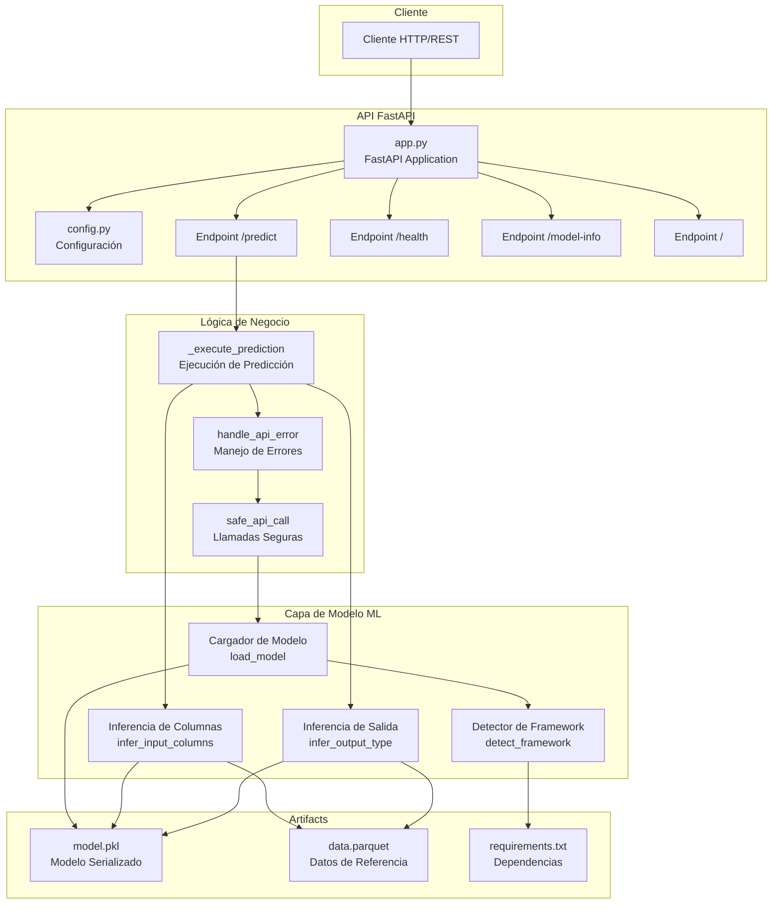
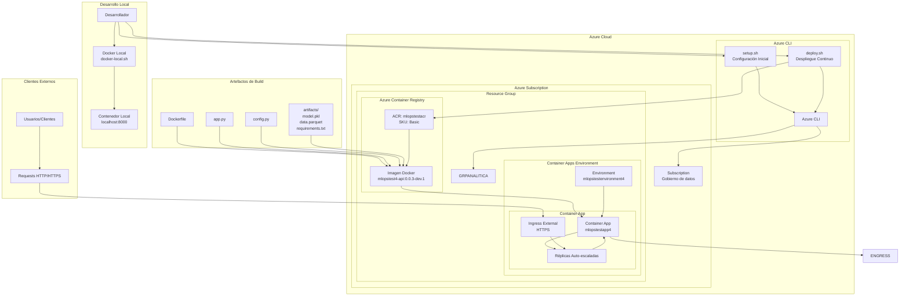
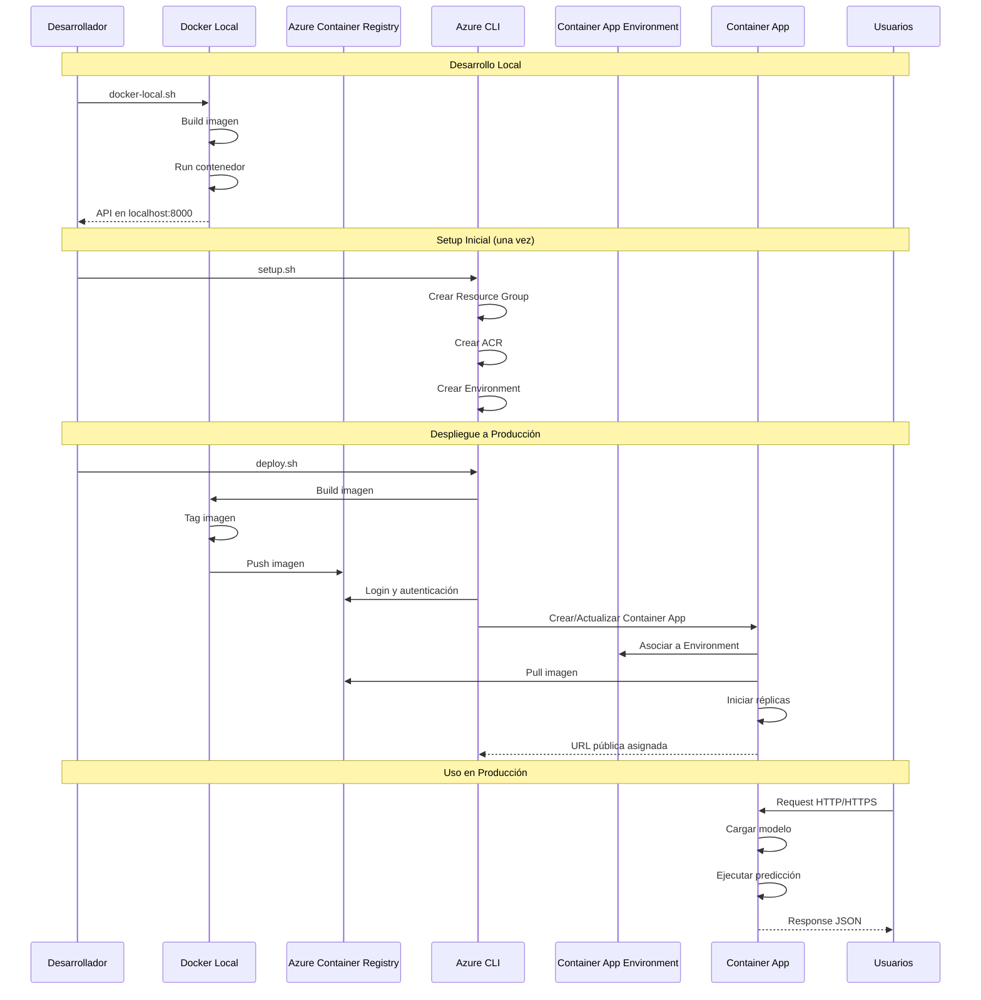
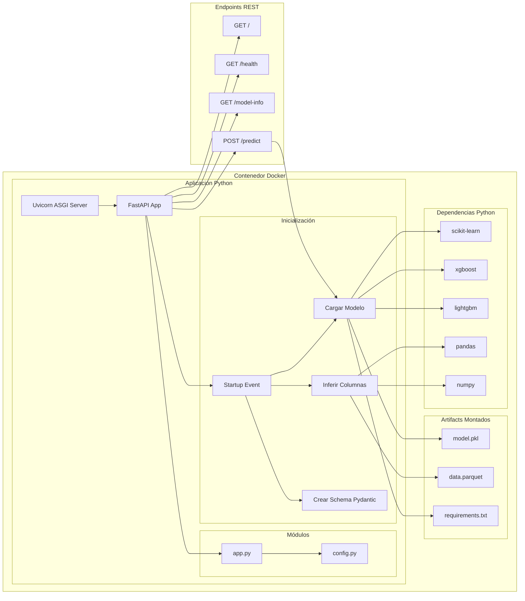
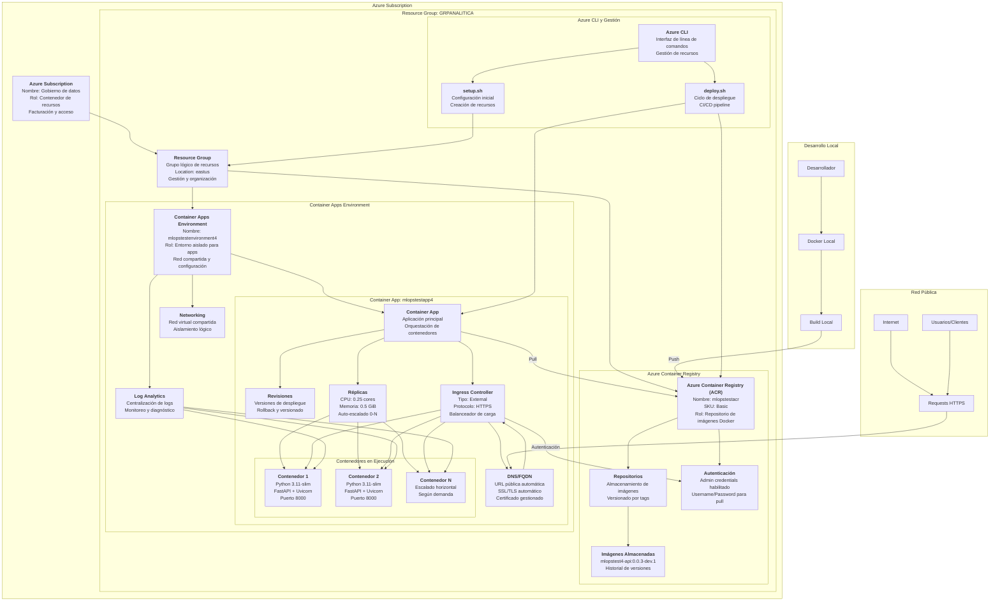
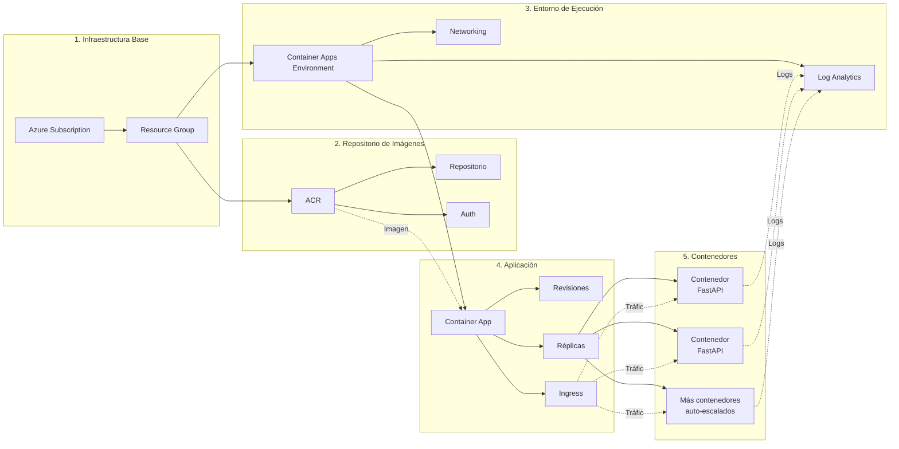
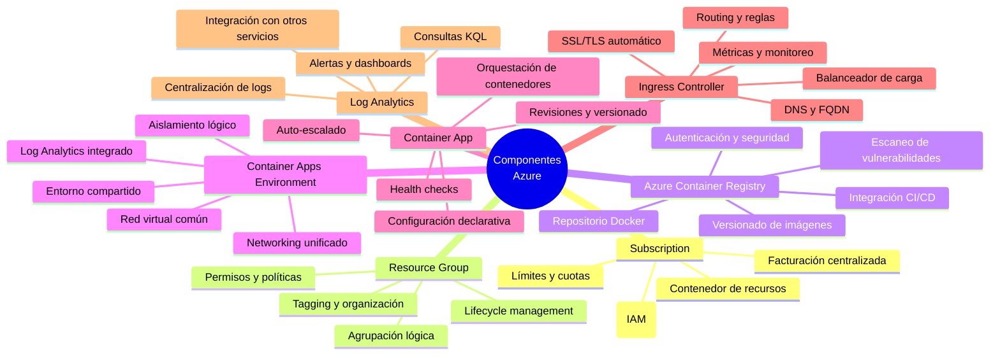
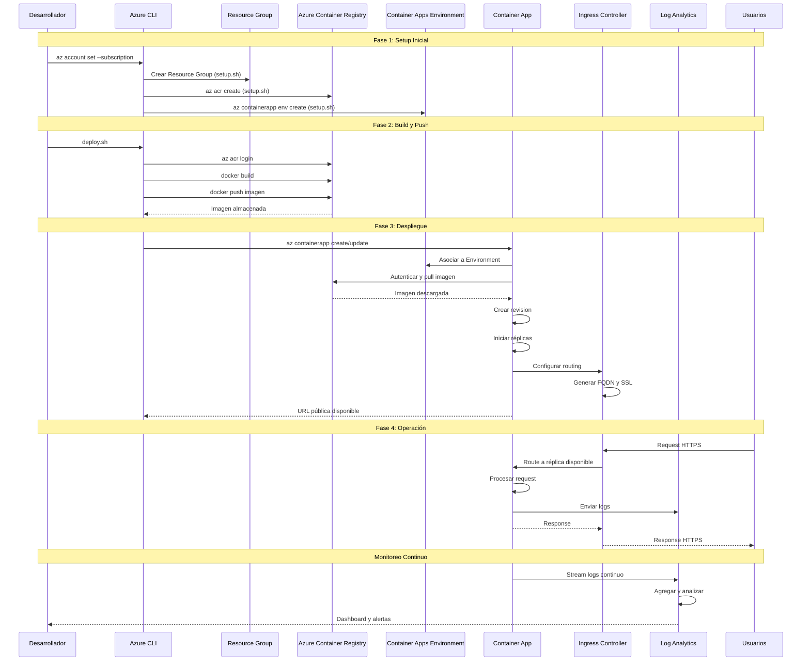

# Diagrama de Despliegue y Componentes - MLOps Canvas

## Diagrama de Componentes del Sistema

## Diagrama de Despliegue en Azure

## Flujo de Despliegue

## Arquitectura de Componentes Detallada

## Especificaciones de Despliegue

### Configuración del Container App
- **CPU**: 0.25 cores
- **Memoria**: 0.5 GiB
- **Puerto**: 8000
- **Ingress**: External (público)
- **Escalado**: Automático según demanda

### Componentes del Build
- **Base Image**: python:3.11-slim
- **Puerto Exposición**: 8000
- **Command**: uvicorn app:app --host 0.0.0.0 --port 8000

### Recursos Azure
- **Resource Group**: GRPANALITICA
- **ACR**: mlopstestacr (Basic SKU)
- **Environment**: mlopstestenvironment4
- **App Name**: mlopstestapp4
- **Location**: eastus

## Arquitectura de Componentes Azure - Detallada

## Flujo de Componentes Azure

## Componentes Azure - Descripción de Roles

## Interacciones entre Componentes Azure

## Matriz de Componentes Azure y Responsabilidades

| Componente Azure | Responsabilidad Principal | Características Clave | Integración |
|-----------------|--------------------------|----------------------|-------------|
| **Azure Subscription** | Contenedor de recursos, facturación | Control de acceso, límites | IAM, Cost Management |
| **Resource Group** | Organización y gestión de recursos | Lifecycle, tagging | Todos los recursos |
| **Azure Container Registry** | Repositorio de imágenes Docker | Versionado, autenticación | Container App, CI/CD |
| **Container Apps Environment** | Entorno compartido y aislado | Networking, logs centralizados | Container Apps |
| **Container App** | Orquestación y ejecución | Auto-escalado, revisiones | Environment, ACR |
| **Ingress Controller** | Balanceo de carga y routing | SSL/TLS, DNS automático | Container App |
| **Log Analytics** | Centralización y análisis | KQL queries, alertas | Environment |
