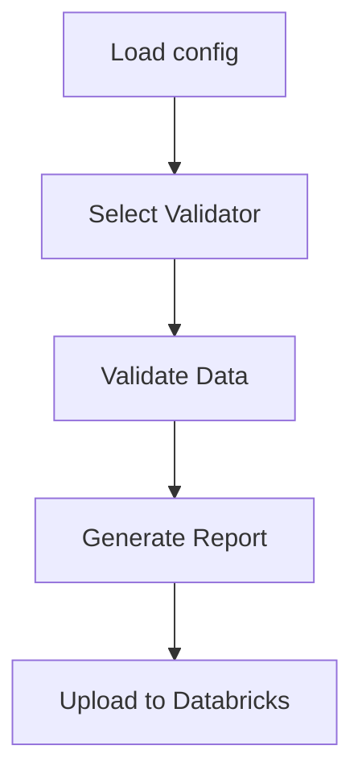

# Data Ingestion Validation Module

Este modulo implementa validaciones de datos de ingesta siguiendo arquitectura hexagonal. Asegura que los datos cumplen requisitos basicos antes de entrenar modelos.

