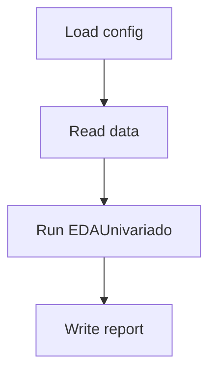

# Modulo de EDA Univariado

Esta guia describe una implementacion minimalista de un modulo de EDA univariado pensado para pipelines de Machine Learning en Azure Databricks. El proyecto se organiza con puertos y adaptadores para maximizar la reutilizacion y las pruebas automatizadas.

## Tecnicas y algoritmos
- Estadisticos descriptivos via `pandas.DataFrame.describe`.
- Conteo y moda para variables categoricas.
- Histogramas con `seaborn.histplot`.
- Deteccion de outliers empleando IQR.

## Arquitectura
- Patron **hexagonal** separando dominio de infraestructura.
- Configuracion central en YAML.
- Dependencias gestionadas con **Poetry**.

```text
eda_univariado/
├── core/
│   ├── stats.py
│   └── plots.py
├── ports/
│   ├── loader.py
│   └── writer.py
├── adapters/
│   ├── pandas_loader.py
│   └── json_writer.py
├── config/
│   └── config.yaml
└── example_use.py
```

## Ejemplo de uso
```python
from pathlib import Path
import yaml

from eda_univariado.adapters.pandas_loader import PandasLoader
from eda_univariado.adapters.json_writer import JsonWriter
from eda_univariado.core.stats import EDAUnivariado

with open(Path("src/eda_univariado/config/config.yaml"), "r", encoding="utf-8") as fh:
    cfg = yaml.safe_load(fh)

loader = PandasLoader(Path(cfg["paths"]["input"]))
data_raw = loader.load()

eda = EDAUnivariado(cfg)
report = eda.run(data_raw)

JsonWriter(Path(cfg["paths"]["output_report"]) / "report.json").write(report)
```

## Pipeline

