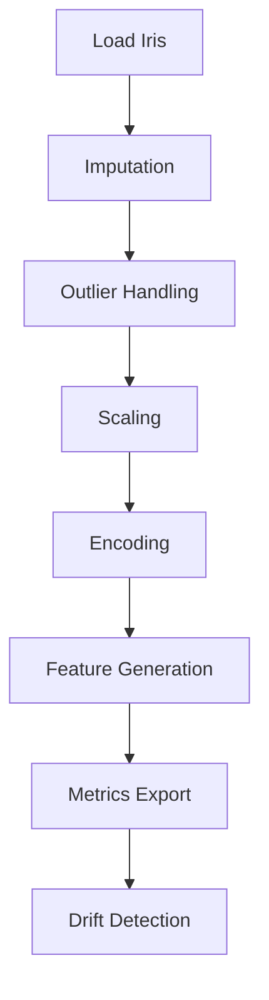

# Feature Engineering Pipeline

Este módulo implementa un pipeline modular para generar features sobre el dataset de iris.
Las etapas se implementan siguiendo arquitectura hexagonal, con *ports* y *adapters* en cada paso.

Cada paso se encapsula en un adaptador que implementa su interfaz correspondiente para facilitar
la extensión y pruebas.
