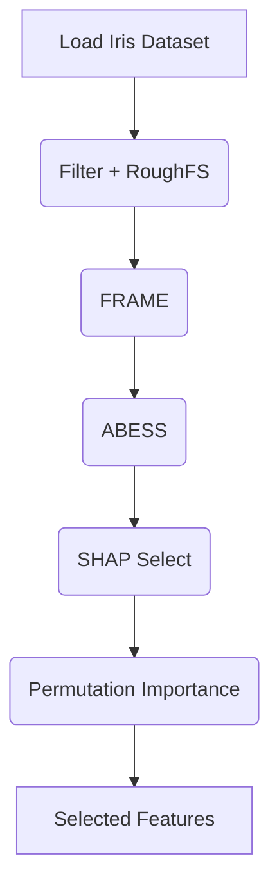

# Feature Selection Pipeline

The helper :func:`feature_selection.feature_selection_task.run_feature_selection`
executes this pipeline on a ``pandas.DataFrame``. The function allows selecting
a specific technique or running the entire sequence by passing ``technique="all"``.
For large datasets you may specify ``sample_fraction`` to speed up heavy steps
like SHAP or permutation importance.

For a complete description of the task interface see
``docs/feature_selection_task.md``.
