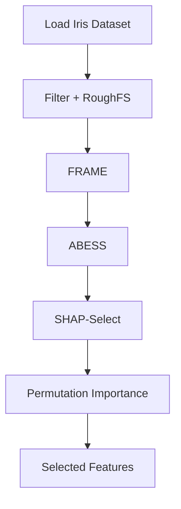

# Feature Selection Pipeline

```mermaid
flowchart TD
    A[Load Iris Dataset] --> B[Filter + RoughFS]
    B --> C[FRAME]
    C --> D[ABESS]
    D --> E[SHAP-Select]
    E --> F[Permutation Importance]
    F --> G[Selected Features]
```
