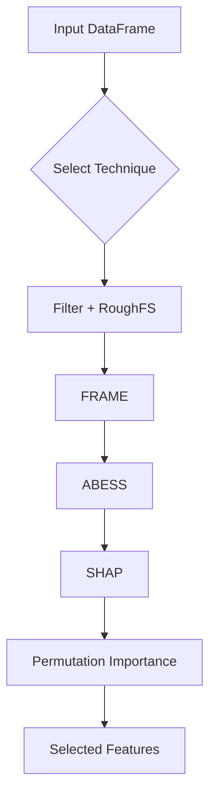

# Feature Selection Task

This document describes the `run_feature_selection` function located in
`src/feature_selection/feature_selection_task.py`. The helper provides a
scalable and reproducible feature selection workflow using modern techniques.



## Key Features

- **Polars Input**: Accepts a `polars.DataFrame` for efficient I/O.
- **Technique Selection**: Choose among `filter`, `roughfs`, `frame`,
  `abess`, `shap`, `permutation`, or `all` to execute the whole pipeline.
- **Sampling**: Use `sample_fraction` to operate on a subset of data when
  running costly techniques such as SHAP or permutation importance.
- **Logging**: Enable `save_logs` to collect execution time per step.
- **API Export**: The function is re-exported in `feature_selection.__init__`
  for convenient imports.

## Usage Example

```python
import polars as pl
from feature_selection import run_feature_selection

# ``df`` must contain the target column used for supervised methods
result = run_feature_selection(df, "target", technique="all", save_logs=True)
print(result["selected_columns"])
```

The returned dictionary always contains `selected_columns`. When
`output_selected_only=False`, it also includes `dropped_columns`.
When `save_logs=True`, the dictionary contains a `selection_report`
listing the duration of each step.
