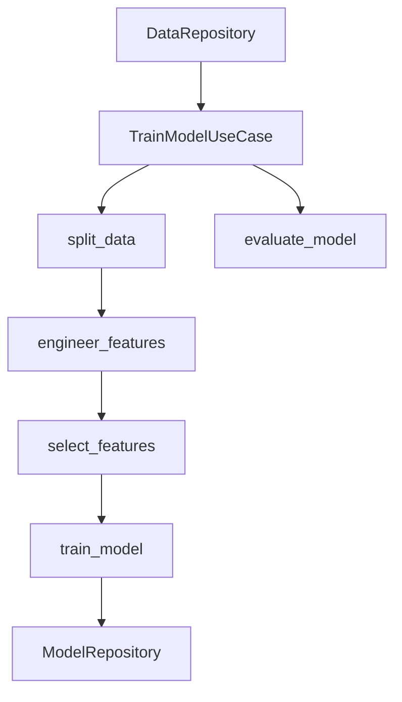

# Diagrama de flujo - Pipeline Hexagonal

```mermaid
flowchart TD
    A[DataRepository] --> B[TrainModelUseCase]
    B --> C[split_data]
    C --> D[engineer_features]
    D --> E[select_features]
    E --> F[train_model]
    F --> G[ModelRepository]
    B --> H[evaluate_model]
```
