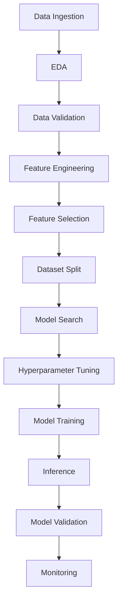

# ML Pipeline Overview

```mermaid
flowchart TD
    A[Data Ingestion] --> B[EDA]
    B --> C[Data Validation]
    C --> D[Feature Engineering]
    D --> E[Feature Selection]
    E --> F[Dataset Split]
    F --> G[Model Search]
    G --> H[Hyperparameter Tuning]
    H --> I[Model Training]
    I --> J[Inference]
    J --> K[Model Validation]
    K --> L[Monitoring]
```
