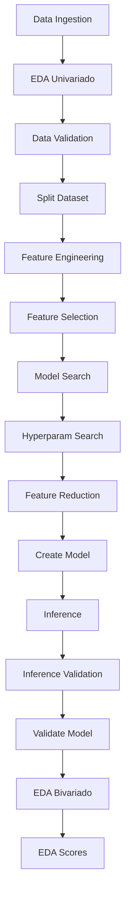

```mermaid
flowchart TD
    A[Data Ingestion] --> B[EDA Univariado]
    B --> C[Data Validation]
    C --> D[Split Dataset]
    D --> E[Feature Engineering]
    E --> F[Feature Selection]
    F --> G[Model Search]
    G --> H[Hyperparam Search]
    H --> I[Feature Reduction]
    I --> J[Create Model]
    J --> K[Inference]
    K --> L[Inference Validation]
    L --> M[Validate Model]
    M --> N[EDA Bivariado]
    N --> O[EDA Scores]
```
