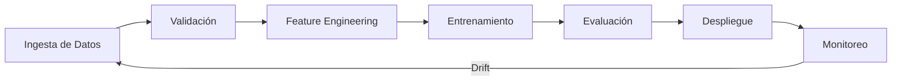

```mermaid
flowchart LR
    A[Ingesta de Datos] --> B[Validación]
    B --> C[Feature Engineering]
    C --> D[Entrenamiento]
    D --> E[Evaluación]
    E --> F[Despliegue]
    F --> G[Monitoreo]
    G -->|Drift| A
```
