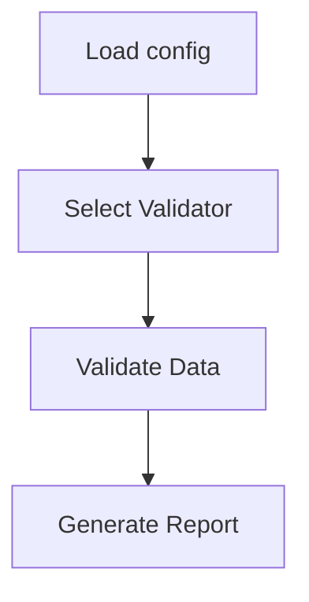

# Validation Inference Module

Este modulo implementa validaciones de inferencia siguiendo arquitectura hexagonal.

```mermaid
flowchart TD
    A[Load config] --> B[Select Validator]
    B --> C[Validate Data]
    C --> D[Generate Report]
```
